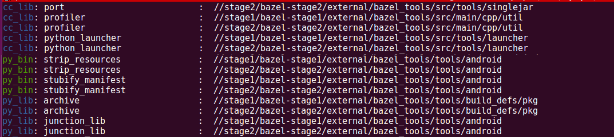

# Bazel list

main script - ```bzlst```

* **bzlst** :  its is an 'ls' for bazel rules like cc\_binary, py\_library etc, under a given directory (recursive). It prints the rule's identifier, name, and its path. Run bzlst to see all options
* **Why bzlst**? building or querying specific targets in bazel requires path information. The problem is looking up this path info. The bash completion plugin that comes with bazel is still a pain to use. Hence, bzlst!

## Setup
* requirements - python3.5+, tqdm (python package, gets installed during setup)
* run ```setup.sh``` (installs tqdm, adds the current directory to PATH)


## screenshots
sample output

